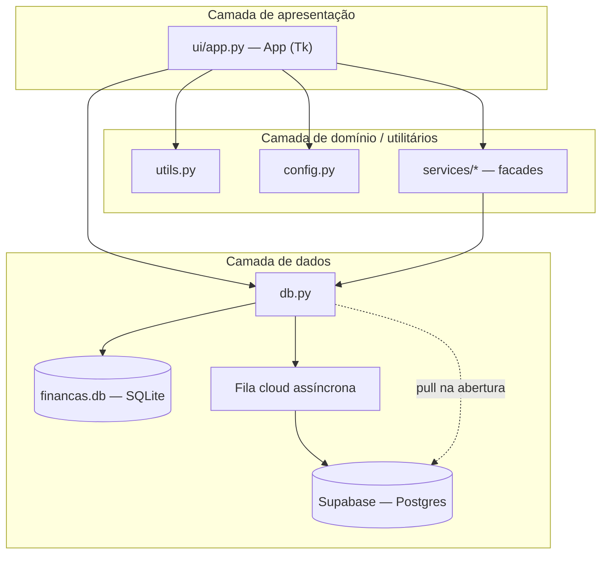
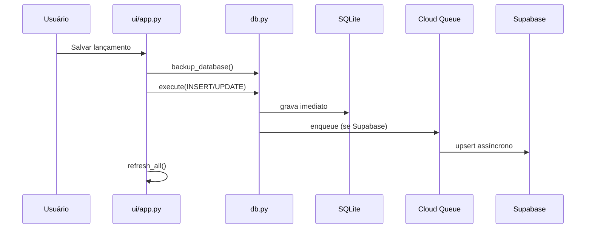

# Arquitetura — Finanças App v3.4.3

## Visão geral

O Finanças App é uma aplicação **monolítica desktop** organizada em camadas simples. Não há servidor web nem API REST própria; toda a lógica roda no processo Python do usuário, com persistência local e sincronização opcional em nuvem.



## Camadas

### 1. Entrada (`main.py`, `financas_app.py`)

- `main.py` é o ponto oficial: inicializa banco e abre a UI.
- `financas_app.py` reexporta `main()` para compatibilidade com execuções antigas (`python financas_app.py`).

### 2. Configuração (`config.py`)

Centraliza:

- `APP_VERSION`, caminhos (`DB_FILE`, `BACKUP_DIR`, `EXPORT_DIR`)
- Listas de categorias padrão, contas recorrentes, cartões, fixos
- Conjuntos `CATEGORIAS_ACUMULATIVAS` e `CATEGORIAS_FIXAS` (regras de negócio)
- `DADOS_INICIAIS` — seed histórico inserido apenas se o banco estiver vazio

### 3. Utilitários (`utils.py`)

Funções puras, sem I/O:

- `brl()` / `parse_valor()` — formatação monetária pt-BR
- `due_date_for_month()` — calcula vencimento respeitando último dia do mês
- `status_pagamento()` — deriva status visual (Pago, Não pago, Vencido, Débito automático)

### 4. Persistência (`db.py`)

Módulo mais crítico (~750 linhas). Responsabilidades:

| Responsabilidade | Implementação |
|------------------|---------------|
| Schema SQLite | `init_db()`, `ensure_local_schema_for_sync()` |
| CRUD genérico | `query()`, `execute()` |
| Categorias | `get_categories()`, `upsert_category()`, etc. |
| Backup/export | `backup_database()`, `export_snapshot_csv()` |
| Supabase | Cliente, mapeamento SQL→REST, sync bidirecional |
| Performance | Leitura local-first; escrita local + fila em thread daemon |

#### Modelo local-first + cloud assíncrona

```text
Leitura:  UI → query() → SQLite (sempre)

Escrita:  UI → execute() → SQLite (imediato)
                        → enqueue_cloud_write() → worker thread → Supabase

Abertura: init_db() → pull_supabase_to_local() (se .env configurado)

Manual:   Sincronizar base  → sync_local_to_supabase()
          Recarregar dados → sync_two_way()
```

A fila `_CLOUD_WRITE_QUEUE` evita bloquear a UI durante latência de rede. `flush_cloud_writes()` é chamado ao fechar o app e antes de sync manual.

#### Tabelas SQLite

```sql
lancamentos (id, mes, categoria, valor, observacao, status_lancamento, updated_at)
  UNIQUE(mes, categoria)

receitas (id, mes, descricao, valor, observacao, updated_at)

metas (id, nome, valor_alvo, valor_atual, observacao, updated_at)

categorias (id, nome, dia_vencimento, tipo, recorrente, ativa, updated_at)
  UNIQUE(nome)

pendencias_ignoradas (id, mes, categoria, vencimento, motivo, criado_em, updated_at)
  UNIQUE(mes, categoria, vencimento)
```

O schema Supabase espelha essas tabelas (`sql/supabase_schema.sql`), com índices únicos equivalentes.

### 5. Serviços (`services/`)

Pacote de **facades finas** que reexportam funções de `db.py` e `utils.py`. Criado na refatoração v1.5.0 para separar responsabilidades, mas a UI ainda importa diretamente de `db.py` na maior parte dos casos.

### 6. Interface (`ui/app.py`)

Classe única `App(tk.Tk)` concentra:

- Estilização (ttkbootstrap ou fallback clam)
- Layout com `ttk.Notebook` (5 abas)
- Toda interação do usuário
- Gráficos matplotlib embutidos
- Integração Git (commit de estado via subprocess)
- Lógica de insights, projeções e sugestão de valores

**Nota arquitetural:** a UI contém lógica de negócio significativa (projeções, agrupamento de cartões, insights textuais). Uma evolução natural seria extrair isso para `services/financeiro.py`, mas na v3.4.3 isso ainda não foi feito.

## Fluxos principais

### Lançamento de despesa



### Controle de pagamentos

Para o mês selecionado, a UI:

1. Carrega categorias recorrentes de `get_recurring_categories()`
2. Cruza com lançamentos existentes
3. Calcula status via `status_pagamento()`
4. Permite edição inline (valor, status, categoria) com backup prévio

### Próximos gastos / Dashboard em aberto

Lista todos os lançamentos com `status_lancamento = 'Não pago'` no mês filtrado, ordenados por vencimento. Ignora itens em `pendencias_ignoradas`.

### Insights

- Período: mês único, intervalo ou todos
- Filtro por categoria ou grupo "Cartões"
- Gráficos: evolução, pizza top gastos, saúde financeira (receitas vs despesas)
- Texto diagnóstico com métricas: taxa de poupança, % fixos, % cartões

## Integrações externas

| Integração | Status | Observação |
|------------|--------|------------|
| Supabase | Ativo (v2.0+) | Sync opcional via `.env` |
| Turso/libsql | Removido | Substituído por Supabase na v2.0.0 |
| Git | Opcional | Botão "Commit estado atual" no cabeçalho |
| matplotlib | Opcional | Gráficos degradam para canvas/texto |
| ttkbootstrap | Opcional | UI usa tema padrão se ausente |

## Arquivos gerados em runtime

| Caminho | Descrição |
|---------|-----------|
| `financas.db` | Banco SQLite (gitignored) |
| `backups/` | Cópias automáticas do `.db` |
| `backups/estado_anterior.db` | Último estado antes de "Commit estado atual" |
| `exports/` | Snapshots CSV de lançamentos |

## Limitações atuais

- Sem autenticação multi-usuário; Supabase usa chave anon com RLS desabilitado (uso pessoal)
- Sem testes automatizados
- `ui/app.py` monolítico dificulta manutenção
- Métodos duplicados no final de `ui/app.py` (legado de merge/refatoração)
- Import/export CSV existe no código (`import_csv`, `export_csv`) mas botões foram removidos do cabeçalho na v3.3.0

## Dependências

```text
matplotlib>=3.8      # Gráficos
supabase>=2.6.0      # Cliente cloud
ttkbootstrap>=1.10.1 # Tema visual moderno
```

Python standard library: `tkinter`, `sqlite3`, `threading`, `queue`, `csv`, `statistics`, `subprocess`.
