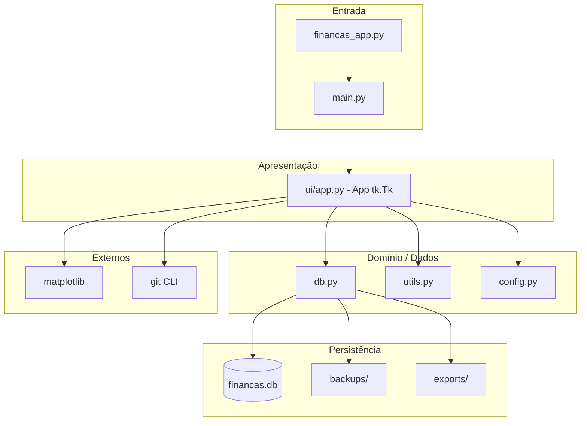
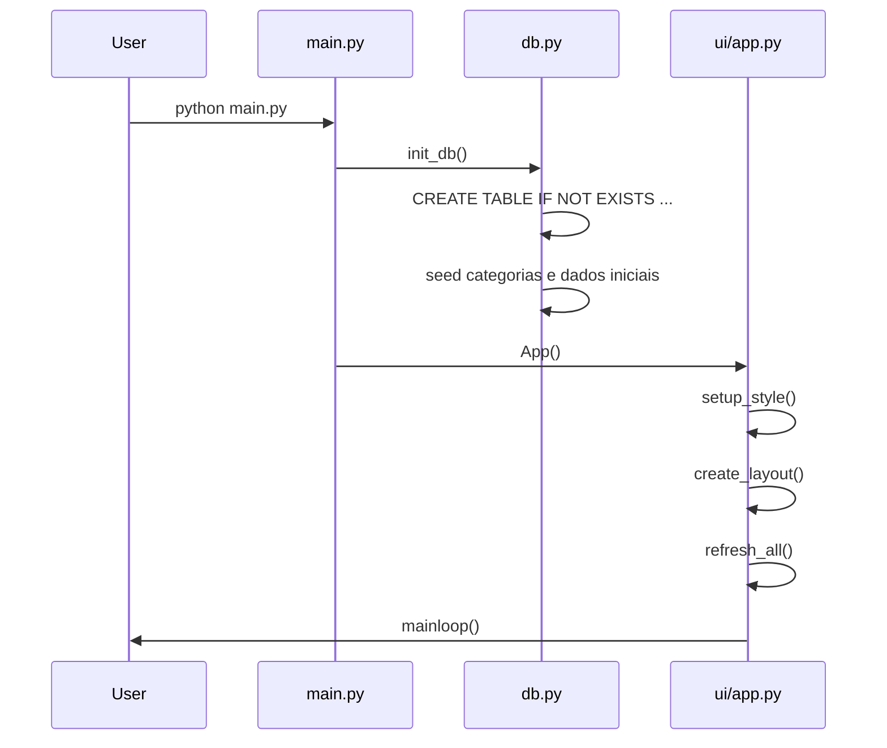
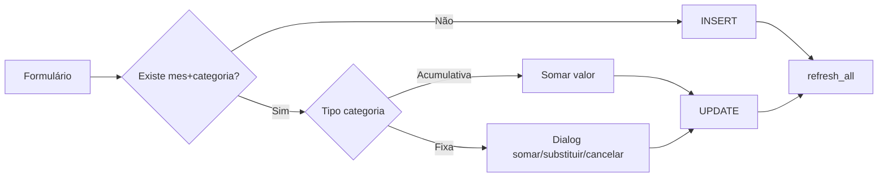

# Arquitetura — App de Finanças Pessoais

## Resumo executivo

O app é uma **aplicação desktop monousuário** com arquitetura em camadas leve: configuração estática, acesso a dados SQLite, utilitários puros e uma camada de UI que concentra a maior parte da lógica de apresentação e orquestração. A versão **v1.6.1** introduziu modularização parcial mantendo compatibilidade retroativa via `financas_app.py`.

## Diagrama de camadas



## Fluxo de inicialização



## Componentes

### 1. Entrada (`main.py` / `financas_app.py`)

- `main.py` chama `init_db()` e instancia `App()`.
- `financas_app.py` reexporta `main()` para usuários que executam o nome legado.

### 2. Configuração (`config.py`)

Centraliza:

- `DB_FILE`, `BACKUP_DIR`, `EXPORT_DIR`, `APP_VERSION`
- Listas de categorias padrão, contas recorrentes com dia/tipo
- Conjuntos `CATEGORIAS_ACUMULATIVAS`, `CATEGORIAS_FIXAS`, `CARTOES`, `FIXOS`
- `DADOS_INICIAIS` — seed histórico 2025-01 a 2026-04 (usado apenas se banco vazio)

### 3. Camada de dados (`db.py`)

Funções principais:

| Função | Descrição |
|--------|-----------|
| `init_db()` | Cria schema, migra colunas, seed de categorias e dados |
| `query()` / `execute()` | Wrapper SQLite sem connection pooling |
| `backup_database(motivo)` | Cópia timestamped para `backups/` |
| `export_snapshot_csv()` | Export completo de lançamentos para `exports/` |
| `get_categories()` | Lista categorias ativas/inativas |
| `get_category_names()` | Nomes para combobox (inclui categorias só em lançamentos) |
| `get_recurring_categories()` | Contas recorrentes do banco ou fallback em `config` |
| `upsert_category()` | INSERT OR UPDATE em `categorias` |

**Observação arquitetural:** cada operação abre e fecha conexão SQLite. Adequado para app desktop local de baixa concorrência.

### 4. Utilitários (`utils.py`)

Funções puras, sem efeitos colaterais:

- `brl(valor)` — formatação monetária pt-BR
- `parse_valor(txt)` — parsing flexível de entrada
- `due_date_for_month(mes, dia)` — vencimento ajustado ao último dia do mês
- `status_pagamento(...)` — máquina de estados visual (Pago, Não pago, Vencido, etc.)

### 5. Interface (`ui/app.py`)

Classe `App(tk.Tk)` com ~70 métodos. Responsabilidades:

#### Layout e estilo
- Tema ttk `clam`, paleta `#f4f6fb` / branco / verde-vermelho para status
- Notebook com 4 abas

#### Aba Lançamentos
- Cards compactos: total, já pago (verde), falta pagar (vermelho)
- Filtro de mês + botão "+ Próximo mês" (`launch_next_month`)
- Formulário CRUD de lançamentos com sugestão automática
- Gerenciador de categorias (modal)
- Treeview de pagamentos com ordenação, duplo-clique e menu contextual (editar célula, deletar)
- Treeview "Próximos gastos" (vencidos + 7 dias) com opção de ignorar pendência

#### Aba Insights
- Filtros: mês único, intervalo (De/Até), todos, categoria (inclui agrupamento "Cartões")
- Gráficos Matplotlib: linha (evolução), pizza (top gastos), combo receitas/despesas/saldo
- Resumo textual + janela "Análise detalhada" com heurísticas de saúde financeira

#### Aba Fluxo de caixa
- CRUD de receitas
- Cards: receitas, despesas lançadas, saldo projetado (receitas − projeção de despesas)

#### Aba Metas
- CRUD de metas com barra de progresso percentual

#### Integração Git
- `commit_current_state()` — salva `estado_anterior.db`, exporta CSV, `git add .` + `git commit`
- `restore_previous_state()` — restaura backup único anterior

### 6. Services (`services/`)

Pacote placeholder com re-exports:

- `backups.py` → `backup_database`, `export_snapshot_csv`
- `categorias.py` → funções de categorias
- `financeiro.py` → `query`, `execute`, utils

A refatoração para services completos **não foi concluída**; a UI ainda importa diretamente de `db.py` e `utils.py`.

## Schema do banco de dados

```sql
-- Despesas mensais (1 registro por categoria/mês)
lancamentos(id, mes, categoria, valor, observacao, status_lancamento)

-- Receitas
receitas(id, mes, descricao, valor, observacao)

-- Metas financeiras
metas(id, nome, valor_alvo, valor_atual, observacao)

-- Catálogo de categorias
categorias(id, nome UNIQUE, dia_vencimento, tipo, recorrente, ativa)

-- Pendências ignoradas na UI
pendencias_ignoradas(id, mes, categoria, vencimento, motivo, criado_em)
```

## Fluxos de dados principais

### Salvar lançamento



### Cálculo de projeção mensal

1. Soma valores com status Pago ou Débito automático → **pago**
2. Soma valores com status Não pago → **não pago**
3. Para cada categoria recorrente sem lançamento: usa sugestão histórica → **pendente**
4. **Projeção** = pago + não pago + pendente

### Insights por período

1. `selected_insight_months()` resolve mês único, intervalo ou todos
2. `trend_for_months()` agrega gastos por mês (filtro opcional por categoria/cartões)
3. `top_categories_for_months()` agrupa cartões como "Cartões" no gráfico de pizza
4. `health_series()` cruza receitas e despesas por mês
5. `calculate_insights_metrics()` calcula taxa de poupança, % fixos, % cartões

## Estado legado na raiz do repositório

O arquivo `financas_app.py` na raiz é uma **versão monolítica anterior** (~644 linhas):

- 2 abas (Lançamentos, Insights)
- Schema simplificado (apenas `lancamentos`)
- Sem receitas, metas, gerenciador de categorias, Git integration
- README referencia "v5" (nomenclatura interna distinta da versão modular)

## Limitações arquiteturais conhecidas

| Limitação | Impacto |
|-----------|---------|
| Lógica de negócio na UI | Dificulta testes unitários e reutilização |
| Conexão SQLite por query | Aceitável hoje; gargalo se volume crescer muito |
| Services incompletos | Estrutura modular ainda não reflete separação real |
| Dados em Git | `financas.db` versionado; commits de dados misturados com código |
| Single-user local | Sem auth, sync ou multi-dispositivo |
| Tkinter | UI nativa desktop; sem versão web/mobile |

## Dependências

```
matplotlib>=3.8   # requirements.txt — gráficos (opcional em runtime)
```

Python stdlib: `sqlite3`, `tkinter`, `csv`, `statistics`, `calendar`, `subprocess`, `shutil`, `pathlib`, `datetime`.
